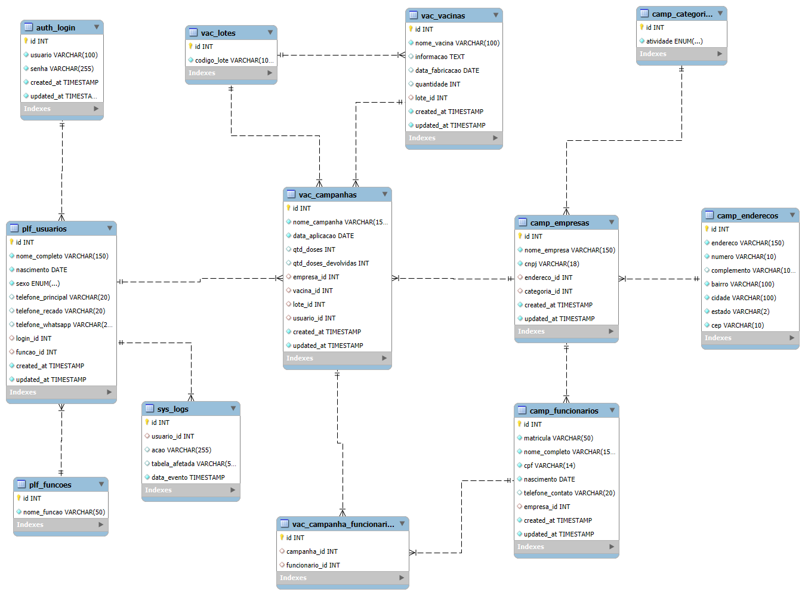

##  Visão Geral

**VaxLogix** é uma aplicação web desenvolvida para gerenciar campanhas de vacinação em ambientes corporativos. O sistema oferece controle completo sobre empresas participantes, funcionários, vacinas e campanhas, promovendo rastreabilidade, organização e eficiência operacional durante todo o processo de imunização.

##  Funcionalidades

- Cadastro e gerenciamento de empresas participantes.  
- Gestão de colaboradores das empresas e da equipe de vacinação.  
- Controle completo de vacinas, com registro de lotes e dados técnicos.  
- Criação, execução e acompanhamento de campanhas de vacinação.  
- Geração de relatórios de entrada e saída de vacinas por campanha.

##  Tecnologias

  
  
  
  

##  Status do Projeto

<strong>Atividades Concluídas</strong>

✅ Modelagem e documentação do banco de dados (planejamento, diagrama ER e script SQL com integridade aplicada)

 

<strong>Atividades Pendentes</strong>

❌ UX Designer layout (protótipo da interface e definição visual pendente)

❌ Autenticação de usuários (backend da tela de login)

❌ Tela de dashboard (resumo de campanhas e status de vacinação)

❌ CRUD de empresas (cadastro, edição e exclusão de empresas)

❌ CRUD de colaboradores (vinculados a empresas)

❌ CRUD de vacinas (com dados técnicos e lote)

❌ CRUD de campanhas (associação de empresas, colaboradores e vacinas)

❌ Geração de relatórios (entrada e saída de vacinas por campanha)

❌ Tela de administração (gerenciamento completo do sistema)

❌ Responsividade e testes de usabilidade (interface em diferentes dispositivos)

❌ Otimização e segurança (validações, proteção de dados)

##  Observação

<strong><em>Projeto aplicado para estudos.</em></strong>

##  Acesso ao Projeto

🔗 [https://almeidahproject.free.nf/vaxlogix/](https://almeidahproject.free.nf/vaxlogix/)

##  Screenshots

  
Diagrama Entidade-Relacionamento do banco de dados VaxLogix
